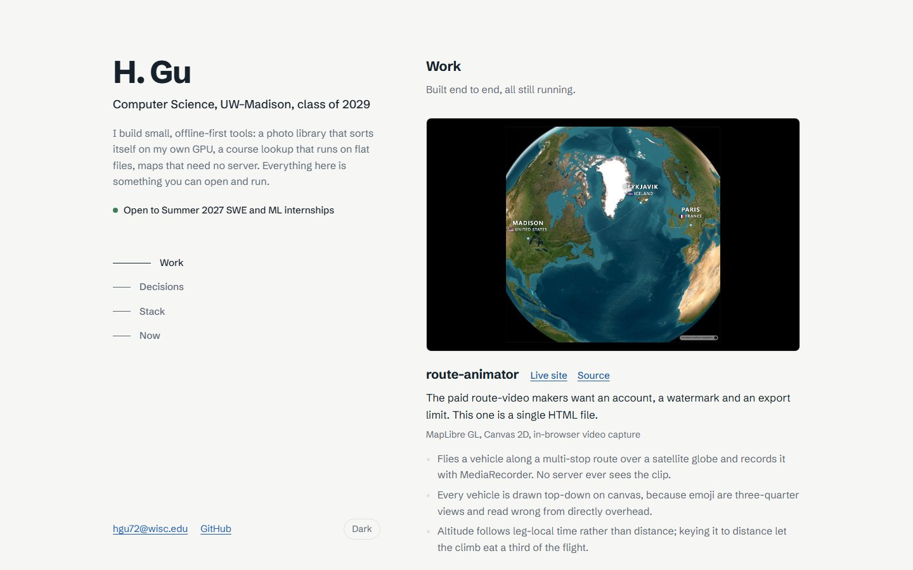
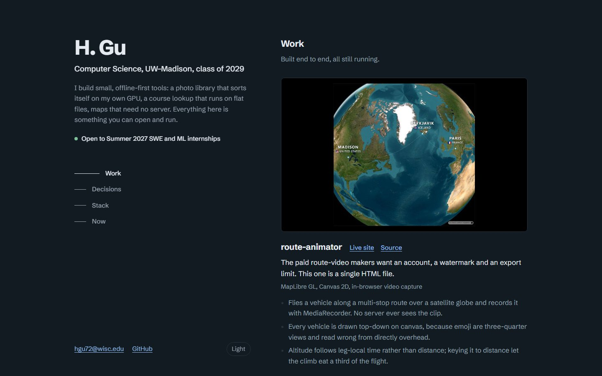

# webgrs.github.io

Personal portfolio site: **<https://webgrs.github.io>**

Dark theme

One `index.html` plus project screenshots in `assets/`; no framework, trackers, or build step. It follows the system light/dark setting, and a toggle overrides it. The two-column layout with a sticky side panel takes after [Brittany Chiang's v4](https://github.com/bchiang7/v4).

## Projects linked

- [route-animator](https://github.com/WEBGRS/route-animator): satellite-globe route videos in the browser
- [uw-course-lookup](https://github.com/WEBGRS/uw-course-lookup): UW–Madison course lookup, linking to MadGrades and Rate My Professors
- [photo-organizer](https://github.com/WEBGRS/photo-organizer): offline CLIP photo sorter
- [datamap](https://github.com/WEBGRS/datamap): paste data, get a choropleth map
- [geo-spoof](https://github.com/WEBGRS/geo-spoof): Chrome extension that overrides the Geolocation API
- [tophat-watch](https://github.com/WEBGRS/tophat-watch): Chrome extension that alerts when a Top Hat question opens

## Run locally

Open `index.html` in a browser. `python docs/screenshots.py` rebuilds the images above.
