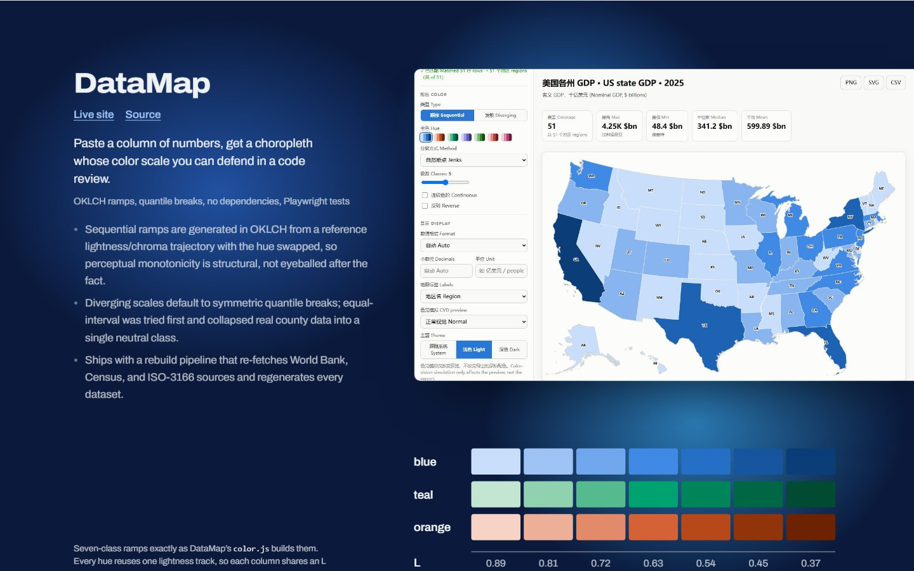

# webgrs.github.io

Personal portfolio site: **<https://webgrs.github.io>**

Dark theme

One `index.html` plus project screenshots in `assets/`; no framework, trackers, or build step. It opens in the light theme; a toggle switches to dark and remembers the choice.

- **Hero:** a contour map of Madison drawn from real USGS 3DEP elevation data (5 m interval, marching squares in a worker on an OffscreenCanvas). It reveals outward from campus on load. On capable machines the map sits under a WebGL height-field water simulation: the pointer leaves ripples that bend the contours, and a click drops a larger one. Hovering also reads out coordinates and elevation.
- **Effects tier:** 2 (WebGL water), 1 (canvas) or 0 (static), chosen from CPU threads, device memory, save-data, reduced motion and the GPU; a frame-time guard can lower it. `?fx=0`, `?fx=1` or `?fx=2` forces a tier.
- **Work index:** hovering a project shows its screenshot beside the cursor, following it with frame-rate independent damping.
- **Case studies:** on wide screens the screenshot stays pinned while the text scrolls, and wipes to the next project. Each project has a small figure of how it works, drawn from its own code: route-animator's altitude profile, DataMap's actual color ramps, geo-spoof's two-world message path.
- **Background:** the same terrain continues behind the page as a faint sheet that scrolls slower than the content.
- **Type:** the name rises letter by letter while Archivo's width axis opens from 62% to 125%. Headings decode from random glyphs of the same case behind a block cursor, the intro line is revealed by a sweeping block, and small print flickers on. The real text stays in the DOM throughout, so screen readers never hear the glyphs.
- **Details:** the pinned screenshot tilts toward the pointer with a soft glare; small controls pull magnetically; buttons send out a water-ring ripple; project stats count up; list rows slide in on a scroll timeline; a marquee lists the tools and data sources behind the projects.
- **Contact:** Lake Mendota and Lake Monona again, as particles that gather on springs when the section comes into view. The pointer pushes them aside; a click scatters them.
- Motion respects `prefers-reduced-motion`.

Motion patterns borrowed from Olivier Larose's [awwwards-landing-page](https://github.com/olivierlarose/awwwards-landing-page) (hover preview), [Lenis](https://github.com/darkroomengineering/lenis) (the `damp` function), Emil Kowalski's [animation tips](https://emilkowal.ski/ui/7-practical-animation-tips), and Vercel's [Web Interface Guidelines](https://github.com/vercel-labs/web-interface-guidelines). The decode, flicker and block-wipe type effects take cues from the [Arknights: Endfield](https://endfield.hypergryph.com/) site.

## Projects linked

- [route-animator](https://github.com/WEBGRS/route-animator): satellite-globe route videos in the browser
- [uw-course-lookup](https://github.com/WEBGRS/uw-course-lookup): UW–Madison course lookup, linking to MadGrades and Rate My Professors
- [photo-organizer](https://github.com/WEBGRS/photo-organizer): offline CLIP photo sorter
- [datamap](https://github.com/WEBGRS/datamap): paste data, get a choropleth map
- [geo-spoof](https://github.com/WEBGRS/geo-spoof): Chrome extension that overrides the Geolocation API
- [tophat-watch](https://github.com/WEBGRS/tophat-watch): Chrome extension that alerts when a Top Hat question opens

## Run locally

Open `index.html` in a browser. `python docs/screenshots.py` rebuilds the images above. `python docs/figures.py` redraws the case-study figures. `python docs/terrain/build_terrain.py` re-fetches the elevation tiles and rewrites the terrain data embedded in `index.html`.
