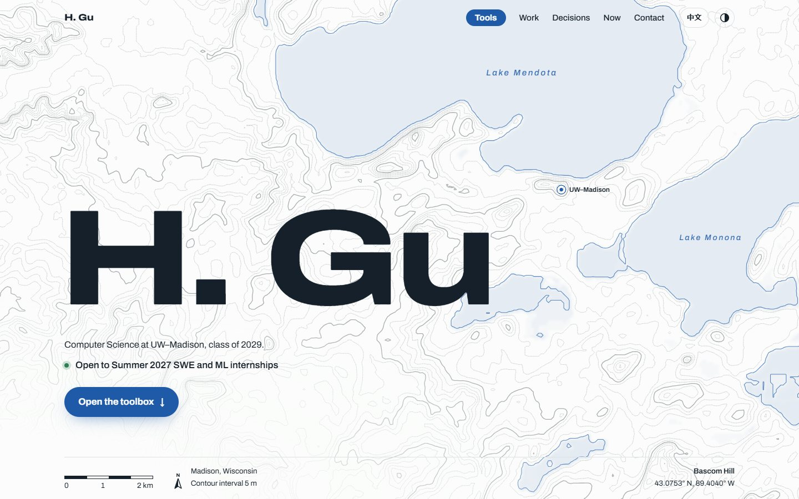
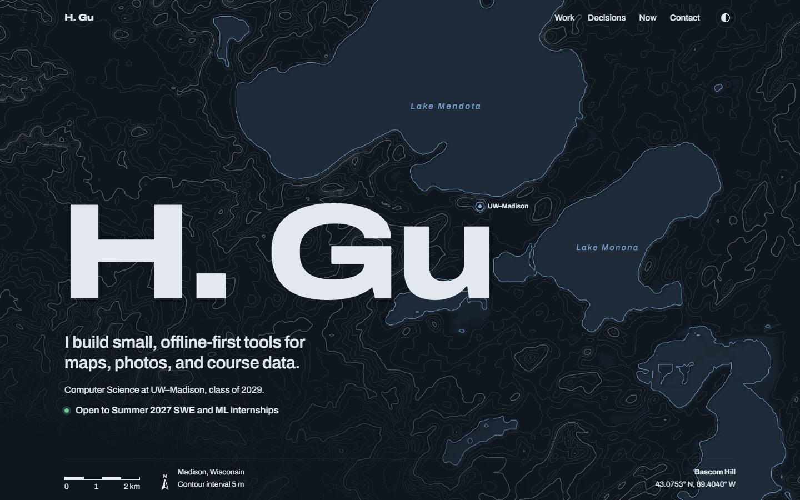
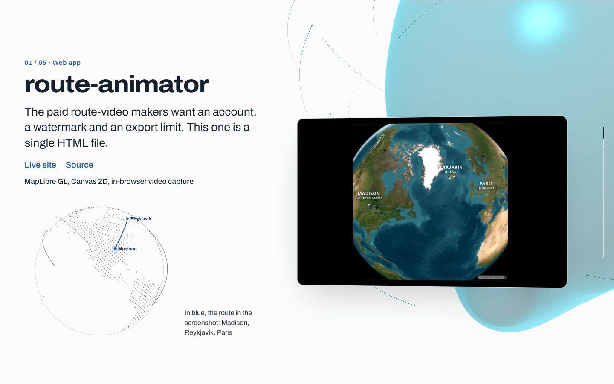
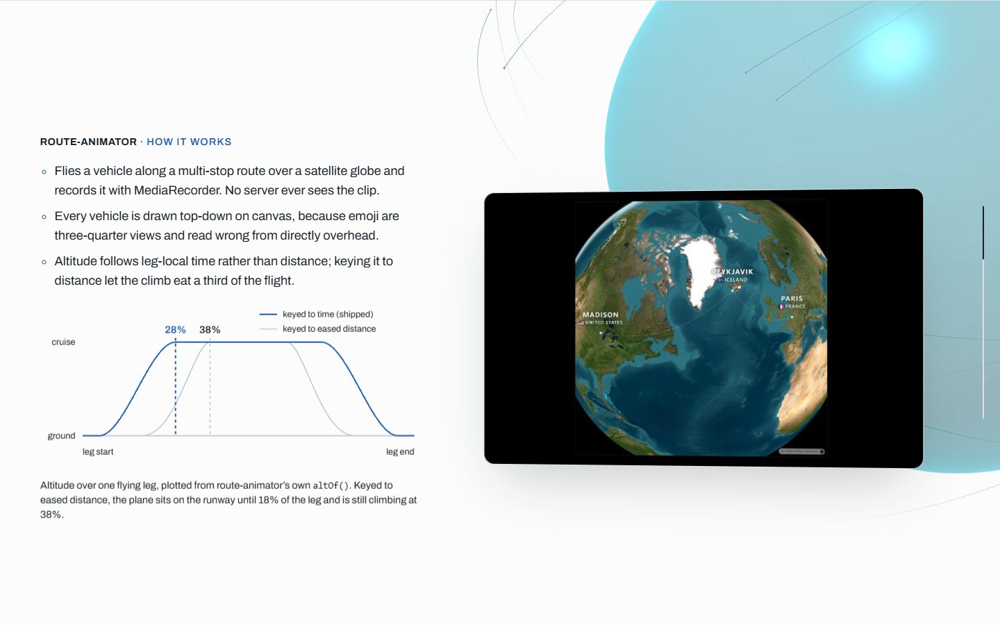
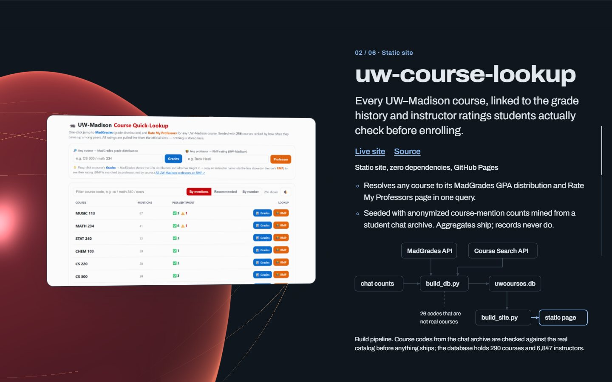
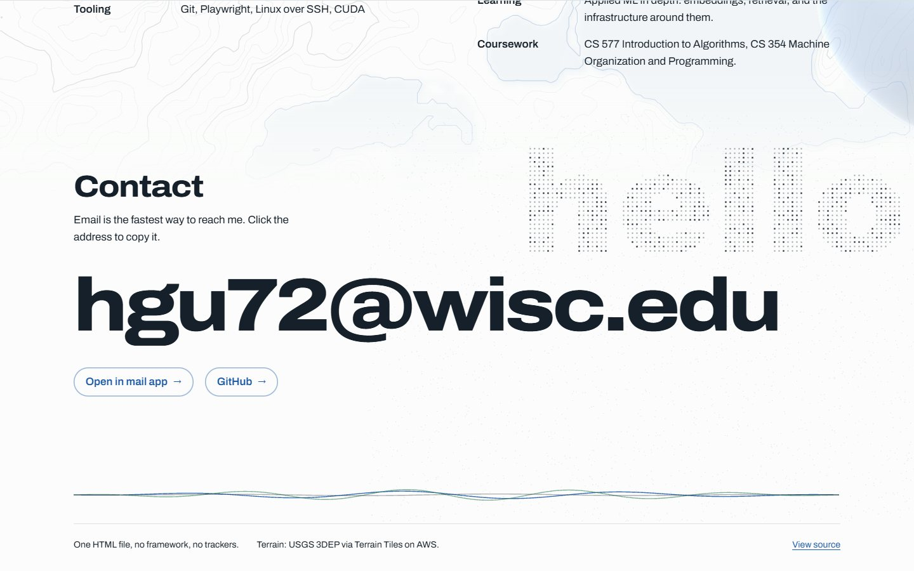
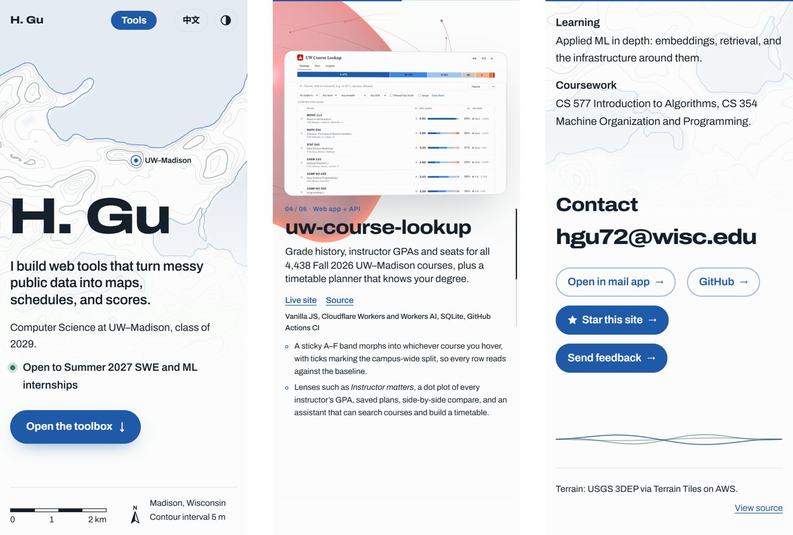

# webgrs.github.io

H. Gu's portfolio site, live at **<https://webgrs.github.io>**. It's a single `index.html`: no framework, no build step, no analytics. The one outside request is the Archivo typeface from Google Fonts.



<details><summary>Dark theme</summary>



</details>

## What's on the page

| Section | What it shows |
|---|---|
| Hero | A contour map of Madison drawn from real elevation data, with the name and a one-line intro |
| Selected work | Major projects, each a few pages with its screenshot, notes and figures drawn from real code or data; smaller projects as compact cards below |
| Decisions I'd defend | Three engineering calls from those projects |
| Stack and Now | The tools and data sources, linked by project; what's happening this term |
| Contact | Email and GitHub, with the two lakes redrawn as particles |

### Hero

The map is traced from USGS 3DEP elevation (via Terrain Tiles on AWS) at a 5 m contour interval. Marching squares runs in a worker on an OffscreenCanvas, and the map reveals outward from campus. The contour under the pointer lights up in a soft patch that spreads slowly; on the WebGL tier the contours 5 m above and below light up with it, fainter. With a mouse, hovering also reads out coordinates and elevation.

Once per session a short loader plays first: five real contour lines of a hill northwest of Madison (43.132° N, 89.512° W, 337 m), drawn stroke by stroke while fonts and terrain load.

### Selected work



The index lists the major projects. Hovering one shows its screenshot beside the cursor, with edges that ripple while the picture inside stays still.

Below the index the projects become pages on one pinned stage: an overview with links and what it's built with, then the decisions behind it and a figure of how it works. A project has as many pages as it needs: the overview, then how it works, and for the data-heavy ones what the data says. Every page uses the same type scale, the largest at which all of them fit.



Paging works like slides. One wheel notch, key press or swipe plays the whole turn and holds the rest of the gesture until it goes quiet, so a transition never stops halfway; dragging the scrollbar lands on the nearest page. Between projects the screenshot glides to the other side while the next one dissolves in over it. Within a project only the notes change. The blocks of each page arrive in turn: the title letter by letter, then the summary, links, each point, and the figure, which draws itself in.

Behind the screenshot sits a translucent liquid orb in a different colour for each project. It's drawn flat, a distance field with a rippling edge lit as if it were a sphere, so it costs little. With every project it swings to its next place and the new colour washes across it from the side it's heading to. A small droplet orbits it and merges with it now and then, and a few motes circle it on tilted orbits with fading trails, speeding up while it travels and easing off after.



### Contact



Lake Mendota and Lake Monona return as particles on springs. Every few seconds they sweep into the word "hello" and back, changing from water blue to ink, but never while the pointer is over them or for ten seconds after a click. The pointer pushes them aside and a click switches the shape. Clicking the address copies it.

### Behind the page

The terrain continues behind everything as a faint sheet that scrolls slower than the content (a ScrollTimeline, so it moves on the compositor), and fades out while the work pages fill the screen. Elsewhere: the stack as a constellation in which tools used by the same project are linked, a raymarched liquid sphere half past the edge of the Now list, and a sine-wave signal line above the footer.

## On a phone



On a portrait phone the work section is paged like the desktop one, with the screenshot on top and the notes under it. Held sideways, or in a short window, it's a single-column list instead, and its screenshots unroll as they arrive. Below 900 px blocks rise in as they scroll into view and a thin bar at the top tracks reading progress. The Stack and Now lists put each label above its text.

Phones leave out what needs a mouse or a wide screen: the map's elevation readout, the stack constellation and the contact particles. Tablets keep the particles, above the contact heading instead of behind it; without hover they skip the readout too. `?full` brings back the constellation, the particles and the orb by the Now list on a phone, whatever it costs.

## English and Chinese

A button in the header (`中文` / `EN`) switches the whole page between the two languages. The choice is remembered, and `?lang=zh` or `?lang=en` in a link overrides it. Both versions are in the HTML and `<html lang>` decides which one shows (`.en` and `.zh` elements, hidden with CSS), so nothing is translated at run time and the scroll effects, the pinned work stage and the figures need no special cases. The work pages refit when the language changes. Project names, tool names and the hero map labels stay in English.

- A project's text lives in two files: `docs/work/<slug>.json` and `docs/work/<slug>.zh.json`. `build.py` refuses to build if the Chinese file is missing a field the page prints.
- Figures are drawn once per language; their strings are looked up in `docs/work/_figs.zh.json`, and a missing entry fails the build.
- The hand-written text in `index.html` (hero, headings, Decisions, Stack, Now, Contact) is written as an `.en` / `.zh` pair in place. Chinese lines that animate use `data-split="char"`, because Chinese has no spaces to split words on.
- The Chinese contact section adds a WeChat QR code (`assets/wechat-qr.png`) and a line inviting requests for similar work; the English page has no counterpart and never loads the image.
- `python docs/check_deck.py --lang zh` pages through the deck in Chinese.

## Performance and accessibility

The page picks an effects tier on load and logs the choice and the reason to the console:

| Tier | What runs | Chosen when |
|---|---|---|
| 2 | WebGL map and effects | the default |
| 1 | Canvas 2D | 4 or fewer CPU threads or 4 GB or less memory, or a software GPU |
| 0 | Static | reduced motion, Save-Data, or 2 or fewer threads or 2 GB or less memory |

`?fx=0`, `?fx=1` or `?fx=2` forces a tier. Every decorative canvas draws only while it's on screen, and canvases on work pages that aren't showing stop drawing. The work section is paged on landscape screens at least 900 × 560 and on portrait screens under 900 px wide and at least 560 px tall; anywhere else, with `prefers-reduced-motion`, or on the static tier, it's a plain list with the same content. Screen readers get plain-text copies of the animated headings. Secondary text is never grey; it's set in the ink colour and told apart by size and weight.

## Projects shown

<!-- work:readme -->
- [route-animator](https://github.com/WEBGRS/route-animator): satellite-globe route videos in the browser
- [madison-rentals](https://github.com/WEBGRS/madison-rentals): rentals near UW–Madison on one map, with every value's source labeled
- [madison-food-map](https://github.com/WEBGRS/madison-food-map): every place to eat in Dane County, scored from six rating sources
- [madison-campus-guide](https://github.com/WEBGRS/madison-campus-guide): the everyday places around UW–Madison, explained in English and Chinese, every fact quoted from its source
- [uw-course-lookup](https://github.com/WEBGRS/uw-course-lookup): UW–Madison course lookup: grade history, seats and a degree-aware timetable planner
- [cutroom](https://github.com/WEBGRS/cutroom): open-source video editor where you and an AI assistant edit the same storyboard file
- [photo-organizer](https://github.com/WEBGRS/photo-organizer): offline CLIP photo sorter
- [datamap](https://github.com/WEBGRS/datamap): paste data, get a choropleth map
- [geo-spoof](https://github.com/WEBGRS/geo-spoof): Chrome extension that overrides the Geolocation API
- [tophat-watch](https://github.com/WEBGRS/tophat-watch): Chrome extension that alerts when a Top Hat question opens
- [uw-digest](https://github.com/WEBGRS/uw-digest): daily UW–Madison news, ranked for students and summarized in English and Chinese
<!-- /work:readme -->

## Run locally

```sh
git clone https://github.com/WEBGRS/webgrs.github.io
cd webgrs.github.io
python -m http.server 8792
```

Then open <http://localhost:8792>. Opening `index.html` straight from disk works too, except the hover preview, which falls back to a plain box because WebGL can't read `file:` images.

## Scripts

| Script | What it does |
|---|---|
| `docs/screenshots.py` | Rebuilds the images in this README (Playwright with Chromium) |
| `docs/build.py` | Writes the work index, the project pages, the smaller-project cards, the stack constellation data and the README project list from `docs/work/*.json`; `--check` fails if anything is stale |
| `docs/figures.py` | The figure functions `build.py` calls, one per `fig` name |
| `docs/data/extract_*.py` | Aggregate a project's data into the small JSON files its figures draw from |
| `docs/check_deck.py` | Pages through the deck in headless Chromium and reports console errors and any page that overflows |
| `docs/terrain/build_terrain.py` | Re-fetches the elevation tiles and rewrites the terrain data embedded in `index.html` |
| `docs/land/build_land.py` | Rebuilds the 1° land mask for the route-animator globe |

## Adding a project

Every project is one file, `docs/work/<slug>.json`; nothing else in `index.html` is edited by hand.

1. Put the screenshot in `assets/` (16:10 reads best) and write the JSON, plus `<slug>.zh.json` with the Chinese for every field the page prints. `"tier": "major"` gives it pages on the pinned stage, `"tier": "minor"` a small card under it. Flipping the word promotes or demotes a project.
2. For a major project, give each page its notes and, optionally, a `fig` name and caption. A figure is a function in `docs/figures.py` registered in `FIGS`; if it draws real data, an `extract_*.py` script writes the numbers it needs into `docs/data/`.
3. `python docs/build.py`, then `python docs/check_deck.py` and look at the new pages in both themes.

A project nobody can open (a private repository, a local tool) is a minor card with no `links`; a private repository is never linked. A card can also carry a `"credit"` line, shown small under it.

The orb behind a project takes its colour from the `color` pair in the JSON, so neighbouring projects should differ in hue; `build.py` warns when two are too close. The stage, the orb poses and the constellation all follow the number of projects, so none of them needs touching.

## Credits

Motion patterns borrowed from Olivier Larose's [awwwards-landing-page](https://github.com/olivierlarose/awwwards-landing-page) (hover preview), [Lenis](https://github.com/darkroomengineering/lenis) (the `damp` function), Emil Kowalski's [animation tips](https://emilkowal.ski/ui/7-practical-animation-tips), and Vercel's [Web Interface Guidelines](https://github.com/vercel-labs/web-interface-guidelines). Some of the decorative effects started from a local gallery of motion studies.
